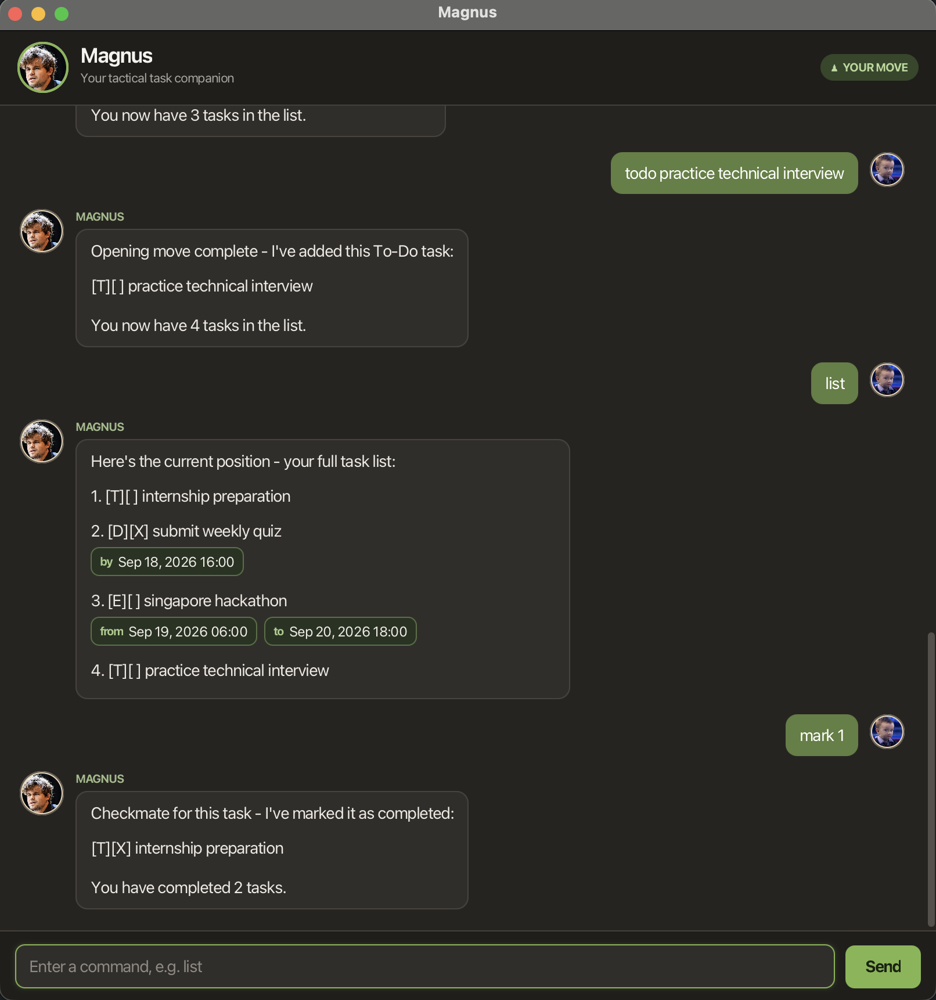

# Magnus User Guide

**Magnus** is a desktop chatbot that helps you manage to-dos, deadlines, and events through short text commands. Type a command, press <kbd>Enter</kbd> or select **Send**, and Magnus will respond in the chat.



- [Quick start](#quick-start)
- [Command basics](#command-basics)
- [Features](#features)
- [Saving your data](#saving-your-data)
- [Command summary](#command-summary)

## Quick start

1. Ensure that Java 25 is installed on your computer.
1. Download `magnus.jar` from the [latest release](https://github.com/Nguyen-Phuc-Thang/ip/releases/latest).
1. Place `magnus.jar` in the folder where you want Magnus to keep its data.
1. Open a terminal in that folder and run:

   ```shell
   java -jar magnus.jar
   ```

1. When the Magnus window opens, try adding and viewing a task:

   ```text
   todo prepare tutorial notes
   list
   ```

## Command basics

- Words in `UPPER_CASE` are values that you supply. For example, replace `DESCRIPTION` with `prepare tutorial notes`.
- Enter every command on one line.
- Dates use `dd/MM/yyyy`. Date and time values use `dd/MM/yyyy HHmm`, with a 24-hour time and no colon. For example, `18/09/2026 1600` means 4:00 PM on 18 September 2026.
- Type `/by`, `/from`, and `/to` exactly as shown. An event must have `/from` before `/to`.
- `TASK_NUMBER` is the positive number shown by `list`. Run `list` before using `mark`, `unmark`, `update`, or `delete`, as numbers in filtered results can differ from the full list.
- Magnus rejects an exact duplicate of an existing task.

## Features

### Adding a to-do: `todo`

Adds a task without a date or time.

Format: `todo DESCRIPTION`

Example: `todo prepare tutorial notes`

### Adding a deadline: `deadline`

Adds a task that must be completed by a specific date and time.

Format: `deadline DESCRIPTION /by DATE_TIME`

Example: `deadline submit project report /by 18/09/2026 1600`

### Adding an event: `event`

Adds a task with a start and end time. The start time must be earlier than the end time.

Format: `event DESCRIPTION /from START_DATE_TIME /to END_DATE_TIME`

Example: `event attend hackathon /from 19/09/2026 0900 /to 20/09/2026 1800`

### Viewing all tasks: `list`

Shows your complete task list and the number used to select each task.

Format: `list`

Magnus uses these labels:

| Label | Meaning    |
| ----- | ---------- |
| `[T]` | To-do      |
| `[D]` | Deadline   |
| `[E]` | Event      |
| `[ ]` | Incomplete |
| `[X]` | Completed  |

### Finding tasks: `find`

Finds tasks whose descriptions contain the query. Matching is not case-sensitive, and the query may contain spaces.

Format: `find QUERY`

Example: `find project report`

### Viewing deadlines on a date: `list_deadline`

Shows only deadlines due on the specified date.

Format: `list_deadline DATE`

Example: `list_deadline 18/09/2026`

### Viewing events in a date range: `list_event`

Shows events that start and end within the inclusive date range. Events that only partly overlap the range are not shown.

Format: `list_event START_DATE END_DATE`

Example: `list_event 01/09/2026 30/09/2026`

### Marking a task as completed: `mark`

Marks the selected task as completed.

Format: `mark TASK_NUMBER`

Example: `mark 2`

### Marking a task as incomplete: `unmark`

Returns the selected task to the incomplete state.

Format: `unmark TASK_NUMBER`

Example: `unmark 2`

### Updating a task: `update`

Updates a task in two steps:

1. Enter `update TASK_NUMBER`, such as `update 2`.
1. When Magnus prompts you, enter the complete replacement details without the `todo`, `deadline`, or `event` command word.

Use the replacement format for the selected task's existing type:

| Task type | Replacement format                                                |
| --------- | ----------------------------------------------------------------- |
| To-do     | `NEW_DESCRIPTION`                                                 |
| Deadline  | `NEW_DESCRIPTION /by NEW_DATE_TIME`                               |
| Event     | `NEW_DESCRIPTION /from NEW_START_DATE_TIME /to NEW_END_DATE_TIME` |

For example, after `update 2`, you could enter:

```text
submit final project report /by 20/09/2026 1700
```

The task type and completion status stay the same. If the replacement is invalid, Magnus leaves the task unchanged and ends the update, so enter `update TASK_NUMBER` again to retry.

### Deleting a task: `delete`

Deletes the selected task immediately, without a confirmation prompt.

Format: `delete TASK_NUMBER`

Example: `delete 3`

### Exiting Magnus: `bye`

Closes Magnus.

Format: `bye`

## Saving your data

Magnus automatically saves every successful task change. No save command is needed.

Your tasks are stored in `data/magnus.txt` inside the folder from which you started Magnus. To use the same tasks on another computer, copy this file to the same relative location there. Avoid editing the file manually, as invalid data can prevent Magnus from starting.

## Command summary

| Action                      | Format                                                      |
| --------------------------- | ----------------------------------------------------------- |
| Add a to-do                 | `todo DESCRIPTION`                                          |
| Add a deadline              | `deadline DESCRIPTION /by DATE_TIME`                        |
| Add an event                | `event DESCRIPTION /from START_DATE_TIME /to END_DATE_TIME` |
| View all tasks              | `list`                                                      |
| Find tasks                  | `find QUERY`                                                |
| View deadlines on a date    | `list_deadline DATE`                                        |
| View events in a date range | `list_event START_DATE END_DATE`                            |
| Mark a task as completed    | `mark TASK_NUMBER`                                          |
| Mark a task as incomplete   | `unmark TASK_NUMBER`                                        |
| Update a task               | `update TASK_NUMBER`, then enter the replacement details    |
| Delete a task               | `delete TASK_NUMBER`                                        |
| Exit                        | `bye`                                                       |
